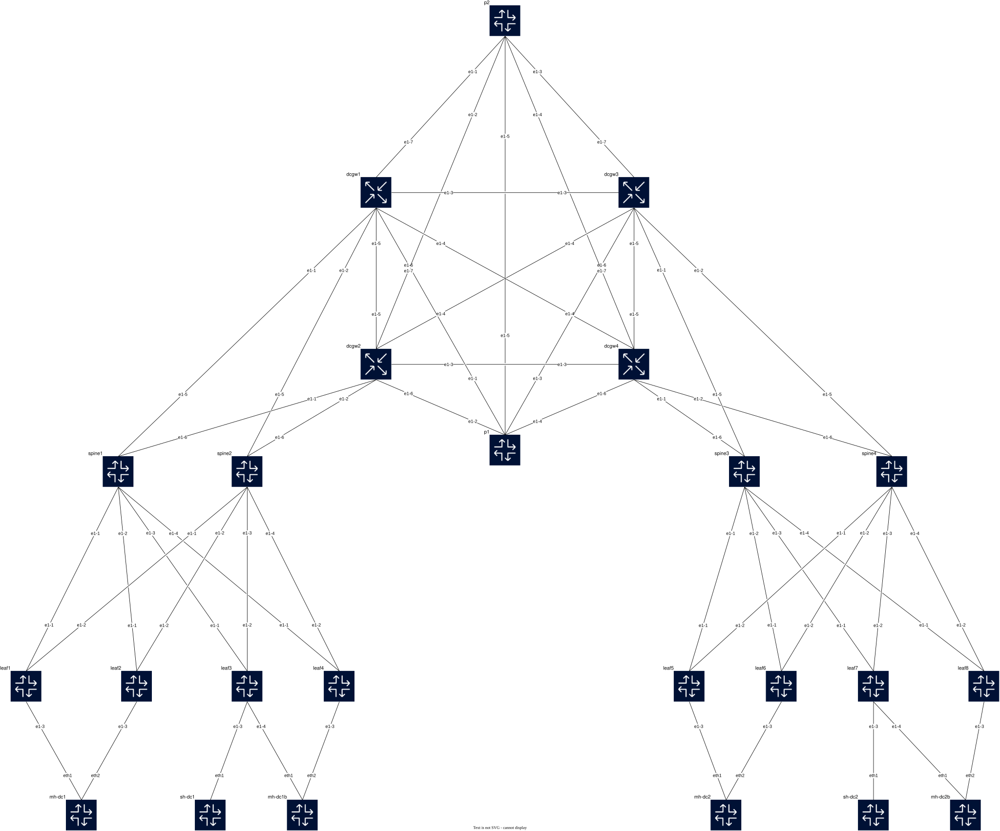

<!--
© 2025 Nokia
Licensed under the BSD 3-Clause License
SPDX-License-Identifier: BSD-3-Clause
-->

# Datacenter Interconnect (DCI) Validated Design — without EDA

A self-contained [Containerlab](https://containerlab.dev) topology that boots a
complete **two-datacenter EVPN fabric interconnected over an MPLS WAN core**, fully
provisioned from flat SR Linux `set /` startup-configs (no EDA). It validates **L2
DCI** (two bridge-domains stretched across both DCs, pinned to different gateways for
per-service load-sharing) and **L3 DCI** (inter-subnet routing across DCs) over **two
transport paths**:

- a **DIRECT** full mesh between the four DCGWs, and
- a **WAN** path through two P/PE core routers.

Both DCI services use **one identical construct on the DCGW**: a single tenant
network-instance bound to **two BGP instances** that re-originate routes between the
**EVPN-VXLAN** (DC) and **EVPN-MPLS / IP-VPN** (WAN) data planes — the RFC 9014
gateway model. DIRECT vs WAN is simply which underlay path IS-IS prefers; the DCGW
configuration is the same for both.

> Target image: `ghcr.io/nokia/srlinux:26.3.1`. SR Linux config syntax is release 26.3.

---

## Topology

- **2 datacenters**, each: 2 spines (7220 IXR-D3L), 4 leaves (7220 IXR-D2L), 2 DCGWs (7250 IXR-X3b)
- **WAN core**: 2 P/PE routers (7250 IXR-X3b)
- **Clients**: 6 `network-multitool` containers (2 multi-homed + 1 single-homed per DC)



Client attachment (each DC has **two** independent all-active Ethernet-Segments plus a
single-homed client, giving enough flows to hash DCI traffic across both gateways):

- **mh-dc1**: bond (eth1→leaf1, eth2→leaf2) = EVPN all-active ES `mh-dc1`
- **mh-dc1b**: bond (eth1→leaf3, eth2→leaf4) = EVPN all-active ES `mh-dc1b`
- **sh-dc1**: eth1 → leaf3 (single-homed)
- **mh-dc2**: bond (eth1→leaf5, eth2→leaf6) = EVPN all-active ES `mh-dc2`
- **mh-dc2b**: bond (eth1→leaf7, eth2→leaf8) = EVPN all-active ES `mh-dc2b`
- **sh-dc2**: eth1 → leaf7 (single-homed)

> `leaf3`/`leaf4` (DC1) and `leaf7`/`leaf8` (DC2) jointly host the 2nd ES, so all eight
> leaves now carry service (no fabric-only spares).

---

## Addressing & identifiers

### Loopbacks (`system0`) and ASNs

| Node | Role | system0 | BGP ASN |
|------|------|---------|---------|
| spine1 / spine2 | DC1 spine | 192.0.2.101 / .102 | 65501 |
| leaf1..leaf4 | DC1 leaf | 192.0.2.11 .. .14 | 65401..65404 |
| dcgw1 / dcgw2 | DC1 DCGW | 192.0.2.151 / .152 | 65000 |
| spine3 / spine4 | DC2 spine | 192.0.3.103 / .104 | 65502 |
| leaf5..leaf8 | DC2 leaf | 192.0.3.15 .. .18 | 65405..65408 |
| dcgw3 / dcgw4 | DC2 DCGW | 192.0.3.153 / .154 | 65000 |
| p1 / p2 | WAN core | 192.0.100.201 / .202 | — (IS-IS/LDP only) |

- DC1 L2-anycast loopback (shared by dcgw1+dcgw2): `192.0.2.150`
- DC2 L2-anycast loopback (shared by dcgw3+dcgw4): `192.0.3.150`
- WAN point-to-point links: `10.255.0.0/24` (direct mesh), `10.255.1.0/24` (DCGW↔P, P↔P)
- Management: `eda_mgmt` 172.21.21.0/24

### Services

| Service | Type | VLAN | DC1 subnet | DC2 subnet | DC EVI/VNI | DCGW WAN |
|---------|------|------|-----------|-----------|-----------|----------|
| `macvrf-l2dci` | L2 DCI (stretched BD-A) | 100 | 10.100.0.0/24 | *(same, stretched)* | 100 | EVPN-MPLS evi 1100, RT 65000:100 |
| `macvrf-l2dci-b` | L2 DCI (stretched BD-B) | 110 | 10.110.0.0/24 | *(same, stretched)* | 110 | EVPN-MPLS evi 1110, RT 65000:110 |
| `macvrf-l3dci` + `ipvrf-l3dci` | L3 DCI | 200 | 10.200.1.0/24 (gw .254) | 10.200.2.0/24 (gw .254) | 201/202 + 3000 | IP-VPN, RT 65000:3000 |

**Per-service L2 gateway load-sharing:** the two stretched bridge-domains deliberately
use **different** gateways of each DC's DCGW pair — **BD-A → dcgw1/dcgw3**, **BD-B →
dcgw2/dcgw4** — in steady state. The pinning is applied **consistently on both DCI
planes and on both DCGW pairs**, so a service uses the same gateway for the local DC
egress *and* the remote DC egress (not just the DC1 side). Each gateway **de-prefers the
bridge-domain it should *not* serve**, matched on that bridge-domain's route-target,
while **still keeping the de-preferred path as a hot standby**:

| Plane | Peering | Steering tool | Where | Match (de-preferred BD) |
|-------|---------|---------------|-------|-------------------------|
| **DC / VXLAN** | eBGP fabric | **AS-path prepend** (local-pref is *not* advertised across the eBGP fabric) | `dcgw-dc-export-dcX` statement **12** | `rt-l2dci-a` = `target:100:100`, `rt-l2dci-b` = `target:110:110` |
| **WAN / MPLS** | iBGP core (AS 65000) | **lower local-preference** (90 vs default 100) | `dcgw-wan-export-dcX` statement **15** | `rt-wan-l2dci-a` = `target:65000:100`, `rt-wan-l2dci-b` = `target:65000:110` |

So `dcgw1`/`dcgw3` (BD-A primary) prepend BD-B on the fabric **and** lower BD-B's
local-pref on the WAN; `dcgw2`/`dcgw4` (BD-B primary) do the mirror for BD-A.

> **Why two different tools.** AS-path prepend is the steering knob on the **eBGP** DC
> fabric (local-pref is not carried across an eBGP boundary). On the **iBGP** WAN core
> prepend can *not* be used: prepending the local AS (65000) onto an iBGP-advertised
> route makes the receiving DCGW drop it as an own-AS loop, which would delete the
> standby path. Local-preference is the correct iBGP knob — it is carried to iBGP peers
> and only **de-prefers** the path, leaving it installed as a hot standby.

> The steering is applied at the **group** level (route-target match), **not** as a
> `bgp-vpn bgp-instance export-policy`. An instance-level export policy on the mac-vrf
> *suppresses* the gateway's EVPN re-origination entirely, which removes the standby path
> and turns a sub-second gateway failover into a multi-second BGP relearn. Keeping the
> steering in the group policy preserves both the per-service pinning **and** fast
> redundancy (verified by `test_l2_per_service_gateway_pinning` and
> `test_gw_redundancy_multiflow[l2]`).

### Logical clients (emulated via netns)

| netns | Service | IP | Homing |
|-------|---------|----|--------|
| mh1-l2a / mh1-l2b | L2 | 10.100.0.11 / .12 | multi-homed DC1 (ES mh-dc1, leaf1/2) |
| mh1-l3a / mh1-l3b | L3 | 10.200.1.11 / .12 | multi-homed DC1 (ES mh-dc1, leaf1/2) |
| mh1b-l2a / mh1b-l2b | L2 | 10.100.0.14 / .15 | multi-homed DC1 (ES mh-dc1b, leaf3/4) |
| mh1b-l3a / mh1b-l3b | L3 | 10.200.1.14 / .15 | multi-homed DC1 (ES mh-dc1b, leaf3/4) |
| mh1-l2c / mh1-l2d | L2 BD-B | 10.110.0.11 / .12 | multi-homed DC1 (ES mh-dc1, leaf1/2) |
| sh1-l2b | L2 BD-B | 10.110.0.13 | single-homed (DC1, leaf3) |
| sh1-l2 / sh1-l3 | L2 / L3 | 10.100.0.13 / 10.200.1.13 | single-homed (DC1, leaf3) |
| mh2-l2a / mh2-l2b | L2 | 10.100.0.21 / .22 | multi-homed DC2 (ES mh-dc2, leaf5/6) |
| mh2-l3a / mh2-l3b | L3 | 10.200.2.21 / .22 | multi-homed DC2 (ES mh-dc2, leaf5/6) |
| mh2b-l2a / mh2b-l2b | L2 | 10.100.0.24 / .25 | multi-homed DC2 (ES mh-dc2b, leaf7/8) |
| mh2b-l3a / mh2b-l3b | L3 | 10.200.2.24 / .25 | multi-homed DC2 (ES mh-dc2b, leaf7/8) |
| mh2-l2c / mh2-l2d | L2 BD-B | 10.110.0.21 / .22 | multi-homed DC2 (ES mh-dc2, leaf5/6) |
| sh2-l2b | L2 BD-B | 10.110.0.23 | single-homed (DC2, leaf7) |
| sh2-l2 / sh2-l3 | L2 / L3 | 10.100.0.23 / 10.200.2.23 | single-homed (DC2, leaf7) |

---

## Control / data plane

**Intra-DC (per datacenter)** — eBGP-unnumbered underlay (IPv6 link-local + RA, BGP
auto-discovery) carrying the EVPN overlay. Leaves are VTEPs for the local services;
spines are pure EVPN transit; DCGWs join the DC EVPN-VXLAN domain as border gateways.
VXLAN never crosses the DCI — every cross-DC service is terminated and re-originated
on the DCGW.

**WAN / DCI MPLS plane (shared by both transport paths)** — IS-IS level-2 runs on
**both** the DCGW direct-mesh links **and** the DCGW↔P / P↔P links, providing the IGP
for the MPLS core. Two MPLS transports run in parallel over that same IS-IS topology:

- **LDP** — `dynamic` label block, discovered on every WAN interface (the original transport).
- **SR-MPLS over IS-IS (`sr-isis`)** — IS-IS segment-routing with a **shared SRGB**
  (`sr-global`, 15000–15999) for prefix/node SIDs and a **non-shareable** block
  (`sr-adj`, 16000–16999) for adjacency SIDs. Each WAN node advertises an `ipv4-node-sid`
  on its `system0` loopback (index = last octet: dcgw1=151 … dcgw4=154, p1=201, p2=202,
  so the SR label is `15000 + index`).

The four DCGWs form an iBGP (AS 65000) full mesh exchanging `evpn` (for L2 EVPN-MPLS)
and `l3vpn-ipv4-unicast` (for L3 IP-VPN). Service next-hops resolve over **either**
transport — every DCGW service sets `next-hop-resolution allowed-tunnel-types [ ldp
sr-isis ]`, so the tunnel-table holds an LDP **and** an SR-ISIS tunnel to each remote
loopback. SR Linux prefers **LDP** (tunnel-table preference 9) over **SR-ISIS**
(preference 11) in steady state; disabling one transport transparently moves all
services onto the other (validated below).

**DIRECT vs WAN** = IS-IS metric. Direct-mesh links use metric **10** (preferred);
DCGW↔P / P↔P links use metric **100** (backup). In steady state DCI rides the direct
mesh; disabling the direct links reroutes the *same* services over the P core. The
LDP/SR transport choice is independent of (and orthogonal to) the DIRECT/WAN path choice.

### The identical 2-instance DCGW construct

Both services bind **one** tenant network-instance to **two** BGP instances:

- **L3 DCI** (`ipvrf-l3dci`, ip-vrf):
  - instance 1 = `bgp-evpn` over **VXLAN**, EVPN-IFL **Type-5** (DC side), RT `3000:3000`
  - instance 2 = `bgp-ipvpn` over **MPLS / IP-VPN (RFC 4364)** (WAN side), `next-hop-resolution allowed-tunnel-types [ ldp sr-isis ]` (resolves over LDP or SR-ISIS), RT `65000:3000`
  - loop prevention: **D-PATH** (BGP domain-path, `draft-ietf-bess-evpn-ipvpn-interworking`) — the recommended mechanism for a multi-instance IP-VRF — plus the per-DC SOO policy (defense-in-depth, same model as L2 below). See the D-PATH note below.
- **L2 DCI** (`macvrf-l2dci`, mac-vrf):
  - instance 1 = `bgp-evpn` over **VXLAN** (DC side), RT `100:100`
  - instance 2 = `bgp-evpn` over **MPLS** (WAN side), RT `65000:100`
  - the DCGW pair in each DC is **anycast**: identical per-instance RD + `inclusive-mcast originating-ip` (`192.0.2.150` / `192.0.3.150`)
  - a second stretched bridge-domain `macvrf-l2dci-b` (VLAN 110, RT `110:110` / `65000:110`, originating-ip `…:.150`) provides per-service gateway load-sharing, pinned to dcgw2/dcgw4 on both DCI planes (see above)

**Domain separation — internal route tags (encapsulation-independent):**

Each DCGW runs its DC-facing and DCI-facing BGP instances inside the *same* tenant
network-instance, so its default-instance BGP RIB holds both the raw DC routes (RT
`100:100` / `3000:3000`) and the raw WAN routes (RT `65000:100` / `65000:3000`). Left
unfiltered, ordinary BGP would re-advertise a raw DC route straight from the eBGP fabric
onto the iBGP WAN mesh (and vice-versa) — bypassing the stitch. To pin each domain's
routes to its own session, routes are marked with a **route internal tag** (`tag-1` = DC
side, `tag-2` = WAN/DCI side) and the session **export** policies drop the wrong tag:

- DC-side routes are tagged `tag-1` — both by the DC-facing `bgp-evpn bgp-instance`
  (which tags the *re-originated/stitched* copy it generates) **and** by the fabric
  import policy `dcgw-dc-import-dcX` (which tags the *raw received* copy that BGP could
  otherwise transit onto the WAN). `dcgw-wan-export-dcX` (statement 10) drops `tag-1`,
  so no DC route — stitched or transit — escapes onto the WAN; only the WAN instance's
  freshly re-originated copy (`tag-2`) is sent. This is the filter that keeps a remote
  leaf's DC route from reaching the far DC unstitched.
- WAN-side routes are tagged `tag-2` — by the WAN-facing instance **and** the WAN import
  policy `dcgw-wan-import-dcX`. `dcgw-dc-export-dcX` (statement 10) drops `tag-2`, so a
  raw WAN route is never re-advertised back onto the fabric.

Internal tags (rather than a `bgp-tunnel-encap` community match) are used **on purpose**:
the separation is then independent of the encapsulation-type. Today the DC side is VXLAN
and the DCI side is MPLS, but a planned iteration runs **VXLAN on both** the DC and the
DCI — where a tunnel-encap match could no longer distinguish the two instances, while the
tag-based policies keep working unchanged.

**Loop prevention — per-DC SOO (RFC 9014 / interworking style, applies to both L2 and L3):**

- every route a DCGW sends — to the WAN (`dcgw-wan-export-dcX`) or into the fabric
  (`dcgw-dc-export-dcX`) — is stamped with the per-DC SOO (`soo-dc1` = `origin:65000:1`,
  `soo-dc2` = `origin:65000:2`)
- both import policies (`dcgw-wan-import-dcX`, `dcgw-dc-import-dcX`) **default-reject** and
  explicitly **drop routes carrying the local SOO** before accepting the required families
  (`evpn`, `l3vpn-ipv4-unicast` on the WAN; `evpn`, `ipv4/ipv6-unicast` on the fabric) — so
  a route one DCGW originated can never be re-imported by its **peer gateway in the same
  DC** and re-injected, closing the stitching loop
- the SOO carries the *originating DC's* identity, so it stops the local re-injection loop
  but does **not** by itself stop a raw DC route from transiting to the *far* DC (whose
  gateways reject only their own SOO) — that cross-domain leak is what the internal-tag
  separation above prevents. The two mechanisms are complementary, not redundant.

**Loop prevention — D-PATH for L3 DCI (recommended for multi-instance IP-VRF):**

Per Nokia's [inter-domain VPN services](https://documentation.nokia.com/srlinux/26-3/books/vpn-services/inter-domain-vpn-services.html#multi-instance-ip-vrf) guidance, `ipvrf-l3dci` carries a BGP **domain-path (D-PATH)** so loop detection and best-path selection are standards-based rather than relying only on policy. A `dpath-domain-id` is set per BGP instance:

| Instance | dcgw1 / dcgw2 (DC1) | dcgw3 / dcgw4 (DC2) |
|---|---|---|
| `bgp-evpn` instance 1 (DC/VXLAN domain) | `65000:1` | `65000:2` |
| `bgp-ipvpn` instance 2 (WAN/IP-VPN domain) | `65000:100` | `65000:100` |

The two DCGWs in a DC share the same EVPN domain-id, and **all** DCGWs share the WAN IP-VPN domain-id. A prefix re-originated into a DC by one gateway and re-injected toward the WAN by its peer carries the WAN domain-id (`65000:100`) and is detected as a loop (route made inactive, `invalid-reason domain-path-loop true`) on re-import. D-PATH length is also a best-path tie-breaker (just after Local-Pref). EVPN-IFL (VXLAN) and IP-VPN (MPLS) domain-ids are deliberately distinct so legitimate cross-DC routes are never mis-flagged.

**L3 host-routes — anti-trombone + multi-homing load-balancing, blocked across the DCI:**

The L3 access bridge-domain is a **distributed anycast IRB** (`10.200.1.254` in DC1, `10.200.2.254` in DC2 on every leaf), so the IP-VRF only knows the `/24`. Remote ingress could then land on *any* leaf in the destination DC and hairpin to the leaf that actually owns the host; and for a **multi-homed** host the anycast `/24` gives no way to load-balance across both Ethernet-Segment leaves. Both are solved with EVPN-IFL **host routes**, advertised by:

```
# per leaf IRB - advertise ARP/ND entries as EVPN-IFL host routes (bgp-evpn instance 1 is the default)
set / interface irb0 subinterface 0 ipv4 arp evpn advertise dynamic interface-less-routing
# per Ethernet-Segment - emit IFL host A-D routes so the host /32 aliases across BOTH ES leaves
set / system network-instance protocols evpn ethernet-segments bgp-instance 1 ethernet-segment <es> advertise-ifl-host-ad-routes
```

`arp evpn advertise dynamic interface-less-routing` advertises each learned ARP/ND entry in an EVPN MAC/IP route that also carries the **IP-VRF interface-less label + route-target** (no `bgp-evpn-instance` needed — instance `1` is the default), so every *other* leaf and DCGW in the host's DC installs a `bgp-evpn-ifl-host` **`/32`** (`/128`) pointing *directly* at the owning leaf's VTEP — no trombone through the anycast `/24`. (The leaves the host is attached to don't need a `/32`: they reach it via the connected `/24` + local ARP.) On a **multi-homed** ES, the IFL host route (the `/32`) is originated by just **one** of the ES leaves — but it carries the segment's **ESI**. `advertise-ifl-host-ad-routes` makes **both** ES leaves emit an EVPN **Auto-Discovery per-EVI (Type-1 AD-per-EVI)** route for that segment, so every remote leaf/DCGW *aliases* the single host `/32` onto **both** their VTEPs (e.g. `10.200.2.21/32 -> [192.0.3.15, 192.0.3.16]`) — inter-subnet traffic to the host is then load-balanced across the ES. This is EVPN **aliasing** (per [`draft-ietf-bess-evpn-aliasing`](https://datatracker.ietf.org/doc/draft-ietf-bess-evpn-aliasing/) / RFC 7432 §8.4): the load-balancing comes from the per-EVI A-D routes, **not** from both leaves re-advertising the host route.

For **control-plane scaling**, those host-routes must **not** cross the DCI: the IFL host routes are DC-side EVPN routes tagged `tag-1` and are dropped on `dcgw-wan-export-dcX` (statement `10`, the same DC-side internal-tag filter described above), and as defense-in-depth statement `8` also rejects the `host-routes-l3dci` prefix-set (`10.200.0.0/16` `mask-length-range 32..32`, plus `::/0` `128..128`) on the `l3vpn` families. The remote DC therefore carries only the covering `/24`, while the local DCGWs and leaves keep the precise (aliased) `/32`s. Verified by `tests/test_dci.py::test_l3_host_route_scoped_to_local_dc` (via `fcli ipv4-rib`): the host `/32` is active on every *non-attached* node of its own DC (multi-homed hosts via both ES VTEPs) and absent — even as a non-best path — on every node of the remote DC, which holds only the `/24`. When `fcli bgp-rib -r l3vpn-v4` is supported, the same test also checks the host `/32` is absent from the **WAN VPNv4** RIB on the remote DC's DCGWs.

---

## Deploy

> **Prerequisite:** the 6 × `ixr-x3b` nodes (4 DCGWs + 2 P routers) require a license.
> Place the license file **`license-srlinux.txt`** in this directory before deploying.
> The 7220 leaves/spines need no license.

```bash
sudo containerlab deploy -t dci-srl.clab.yaml
```

Destroy / redeploy:

```bash
sudo containerlab destroy -t dci-srl.clab.yaml --cleanup
```

Give the fabric ~2–3 minutes to converge (eBGP, IS-IS/LDP, iBGP, EVPN, then client
bootstrap). Inspect a node with `ssh admin@clab-dci-srl-leaf1` (password
`NokiaSrl1!`).

---

## Validation

### Preferred reporting tool: `fcli` (fabric-wide)

For any check that asks "**is this true across the fabric?**" — BGP sessions, the EVPN
RIB, VXLAN tunnels, MAC/ARP tables, Ethernet-Segments, LAGs, interface rates — use
[`fcli`](https://github.com/srl-labs/nornir-srl) (the SR Linux fabric CLI) rather than
SSH-ing into each node. One `fcli` call fans out a single gNMI query to **all 18 SR Linux
nodes** (8 leaves, 4 spines, 4 DCGWs, 2 P routers) and returns one consolidated table, so
you see the whole fabric at a glance instead of scraping `show ...` on 18 boxes.

```bash
# from the repo root (where dci-srl.clab.yaml lives)

# Scope to a subset with the inventory filter (-i) using the topology labels:
#   role = leaf | spine | dcgw | pe        site = dc1 | dc2 | wan
fcli -t dci-srl.clab.yaml bgp-peers                 # all nodes
fcli -t dci-srl.clab.yaml -i role=dcgw bgp-peers    # just the four DCGWs
fcli -t dci-srl.clab.yaml -o json vxlan | jq .      # machine-readable
```

| Want to verify | `fcli` command | Notes |
|----------------|----------------|-------|
| Underlay + overlay BGP up | `bgp-peers` | eBGP fabric + iBGP WAN; all `established`. Table uses two-line AFI headers (e.g. **EVPN** / **R/A/T**); with ``-o json`` keys become ``EVPN R/A/T``, ``U4 R/A/T``, ``VPNv4 R/A/T``, … (received / active / sent per neighbor). |
| EVPN control plane | `bgp-rib -r evpn` (`-t 2` MAC/IP, `-t 5` IP-prefix) | fabric-wide route/next-hop view |
| VXLAN tunnels / VTEPs | `vxlan` | per-leaf VTEP unicast destinations |
| L2 services + MACs | `ni -f Type=mac-vrf`, `mac` | stretched BD-A/BD-B reachability |
| L3 services + hosts | `ni -f Type=ip-vrf`, `irb`, `ipv4-rib`, `arp` | IP-VRF, anycast IRB, IFL `/32`s |
| Multi-homing | `es`, `es-dest`, `lag` | all-active ES state + LACP bundles |
| WAN underlay | `-i site=wan lldp`, `ipv4-rib` | IS-IS/MPLS core adjacencies |
| MPLS transport / tunnels | `tunnel-table` | parallel LDP vs SR-ISIS tunnels + egress port/labels |
| Live link rates / counters | `ifstats -s 10` | per-interface in/out bps **and** cumulative pkts/octets |

**When per-node `show` is better — and why the steps below still use it.** `fcli`
reports SR Linux *state* models, but a few DCI-specific checks need detail it does not
surface, so for those reach into a single node with `ssh admin@clab-dci-srl-<node>`
(or `docker exec -i <node> sr_cli`):

- **MPLS transport / tunnel-table** — `fcli tunnel-table` now gives the fabric-wide view of
  the parallel **LDP vs SR-ISIS** tunnels (preference, egress port, label stack); for the
  per-node preference detail of sections 0, 3–5 you can still use
  `show network-instance default tunnel-table all`.
- **IS-IS adjacencies, LDP sessions, segment-routing / node-SIDs** — the WAN-core IGP and
  label state (section 0, 5); `fcli` has no view of these.
- **Service route-table specifics** — e.g. `show network-instance ipvrf-l3dci route-table
  ipv4-unicast` to see which transport/next-hop a remote prefix resolved over.
- **Making changes** — fault injection and restores (`enter candidate` / `commit now`) are
  config actions, not reporting; `fcli` is read-only.

### 0. Fabric / DCI plane health (on any DCGW, e.g. `dcgw1`)

```
show network-instance default protocols bgp neighbor          # dc-fabric (eBGP) + wan-ibgp (iBGP) Established
show network-instance default protocols isis adjacency        # L2 adjacencies to dcgw mesh + P routers
show network-instance default protocols ldp session           # LDP sessions up
show network-instance default tunnel-table all                # LDP + SR-ISIS tunnels to remote DCGW loopbacks
show network-instance default protocols isis ... segment-routing   # IS-IS SR / node-SID state
show network-instance default protocols bgp routes l3vpn-ipv4 summary
```

### 1. L2 DCI over the DIRECT path

Stretched bridge-domain — a single subnet 10.100.0.0/24 across both DCs.

```bash
# DC1 logical client -> DC2 logical client (same subnet, pure L2)
docker exec clab-dci-srl-mh-dc1 ip netns exec mh1-l2a ping 10.100.0.21
docker exec clab-dci-srl-sh-dc1 ip netns exec sh1-l2  ping 10.100.0.23
```
On a DCGW: `show network-instance macvrf-l2dci bridge-table mac-table all` shows remote
MACs reachable via the EVPN-MPLS (instance 2) next-hop, resolved over the **direct**
mesh (low IS-IS metric).

### 2. L3 DCI over the DIRECT path

Different subnet per DC, routed across the DCI via `ipvrf-l3dci`.

```bash
docker exec clab-dci-srl-mh-dc1 ip netns exec mh1-l3a ping 10.200.2.21
docker exec clab-dci-srl-sh-dc1 ip netns exec sh1-l3  ping 10.200.2.23
```
On a DCGW: `show network-instance ipvrf-l3dci route-table ipv4-unicast` shows the remote
DC subnet learned via IP-VPN; `show network-instance default protocols bgp routes
l3vpn-ipv4` shows the re-originated VPN-IPv4 prefixes.

### 3 & 4. Same services over the WAN path

Force traffic onto the P core by disabling the direct mesh on the DC1 DCGWs, then
re-run the L2 and L3 pings — they keep working, now via `p1`/`p2`:

```bash
# on dcgw1 and dcgw2
enter candidate
set / interface ethernet-1/3 admin-state disable
set / interface ethernet-1/4 admin-state disable
set / interface ethernet-1/5 admin-state disable
commit now
```
Re-check `show network-instance default tunnel-table all` — the tunnels to the
remote DCGW loopbacks now resolve via the `ethernet-1/6` / `ethernet-1/7` (P-facing)
next-hops, and the same client pings/iperf3 still succeed. Re-enable the interfaces to
return to the direct path.

### 5. Per-transport validation: LDP vs SR-ISIS

Both MPLS transports run in parallel. `show network-instance default tunnel-table all`
on a DCGW shows an **`ldp`** *and* an **`sr-isis`** tunnel to every remote loopback (the
SR-ISIS tunnel label is `15000 + node-SID index`, e.g. `15152` for `dcgw2`). LDP is
preferred (tunnel-table preference `9` vs SR-ISIS `11`), so steady-state traffic rides
LDP. Disable one transport on **all six WAN nodes** (`dcgw1..4`, `p1`, `p2`) to prove the
other carries every service on its own:

```bash
# --- Exercise SR-ISIS only: disable LDP on every WAN node ---
for n in dcgw1 dcgw2 dcgw3 dcgw4 p1 p2; do
  printf 'enter candidate\nset / network-instance default protocols ldp admin-state disable\ncommit now\n' \
    | docker exec -i $n sr_cli
done
# tunnel-table now shows only sr-isis tunnels; re-run the section 1/2 pings (all pass).
# restore: replace 'disable' with 'enable' in the printf above and re-run the loop.

# --- Exercise LDP only: remove segment-routing on every WAN node ---
for n in dcgw1 dcgw2 dcgw3 dcgw4 p1 p2; do
  printf 'enter candidate\ndelete / network-instance default protocols isis instance main interface system0.0 segment-routing\ndelete / network-instance default protocols isis instance main segment-routing\ndelete / network-instance default segment-routing\ncommit now\n' \
    | docker exec -i $n sr_cli
done
# tunnel-table now shows only ldp tunnels; re-run the section 1/2 pings (all pass).
# restore: re-apply the SR-ISIS lines from the *.cli configs, or redeploy the lab.
```

> **Disabling SR is a 3-line delete (done in one commit)** because the per-node
> `ipv4-node-sid` depends on the SRGB `global-block`, which in turn lives under
> `segment-routing`. Deleting only the IS-IS `static-label-block` does **not** remove the
> prefix-SID tunnels (those are built from remote node-SIDs and the local SRGB). Cleanest
> restore for the SR-only case is a redeploy, since the `*.cli` startup-configs hold the
> validated dual-transport state.

Reference results from this design: with both transports up, 5 LDP + 5 SR-ISIS tunnels
are active per DCGW; disabling LDP leaves 5 SR-ISIS tunnels (all L2/L3 flows lossless),
and removing SR leaves 5 LDP tunnels (all L2/L3 flows lossless).

---

## Automated validation (pytest)

The manual checks above are also implemented as an ad-hoc [pytest](tests/) suite that
drives the running lab over `docker exec`. It covers steady-state L2/L3 connectivity
(multi-homed + single-homed), **ECMP load-sharing across both DCGWs**, the parallel
**LDP / SR-ISIS WAN transports**, the DIRECT→WAN failover, **DCGW redundancy under
multiple hashed iperf3 flows**, and a **diagonal double-gateway failure** (one DCGW per
DC). Every test that injects a fault restores the topology in teardown.

The suite uses **`fcli`** for fabric-wide gNMI reports (`bgp-peers`, BGP RIBs including
EVPN and—when supported—**L3VPN IPv4** in the WAN `default` instance, `ipv4-rib` in
`ipvrf-l3dci`, `tunnel-table`, `ifstats`). Extra DCGW VPNv4 assertions are skipped
automatically if `fcli bgp-rib -r l3vpn-v4` is not available (older nornir-srl builds).

```bash
cd tests
python3 -m venv .venv && . .venv/bin/activate
pip install -r requirements.txt

# fcli is a REQUIRED prerequisite (fabric-wide reporting over gNMI), not a pip
# dependency. Needs >= 0.4.3 (first release with the tunnel-table report).
# Optional: a current nornir-srl build adds `fcli bgp-rib -r l3vpn-v4` for WAN
# VPNv4 RIB checks on DCGWs (the suite skips those if the mode is missing).
# Install it once as a standalone tool with uv (https://docs.astral.sh/uv/):
uv tool install --force git+https://github.com/srl-labs/nornir-srl   # ensure ~/.local/bin is on PATH

pytest -v                      # full suite (deploy the lab first)
pytest -v -m connectivity      # steady-state + control-plane only (non-disruptive)
pytest -v -m ecmp -s           # multi-flow ECMP spread across both DCGWs
pytest -v -m "not disruptive"  # everything except fault injection
pytest -v -m convergence -s    # WAN/transport failover, GW redundancy + diagonal double failure
```

### pytest-html: per-test log output (optional)

Install (included in `requirements.txt`): **`pytest-html`** (and **`pytest-metadata`** for the
environment table). Build a self-contained report with:

```bash
pytest -v --html=report.html --self-contained-html
```

**Why the “Log” section is empty:** pytest-html fills it from **captured** stdout/stderr
(and pytest’s captured logging). If you pass **`-s`** or **`--capture=no`**, capture is
disabled and the HTML report has nothing to show per test.

**Fix while still watching output on the terminal:** use **`--capture=tee-sys`** instead
of `-s`. Output is copied to both the console and the capture buffer, so the HTML log is
populated. Example (same markers as above, trace-friendly for `DCI_TRACE`):

```bash
DCI_TRACE=1 pytest -v -m convergence --capture=tee-sys --html=report.html --self-contained-html
```

**Python `logging` in tests or helpers:** pass a capture level so pytest records log lines
into the report (especially useful on failures), e.g. **`--log-level=INFO`** or
**`--log-level=DEBUG`** on the same command line (or set `log_level` under `[pytest]` in
`pytest.ini` if you want that for every run).

**Custom snippets** (screenshots, JSON blobs): in a test or fixture, use the
[extras API](https://pytest-html.readthedocs.io/en/latest/user_guide.html#extras) via
`import pytest_html` and `pytest_html.extras.text(...)` / `.json(...)` / `.html(...)`, or
register a
[`pytest_runtest_makereport`](https://docs.pytest.org/en/stable/reference/reference.html#pytest-runtest-makereport)
hook and append to `report.extra`.

### Allure reports (optional)

The test venv includes **`allure-pytest`**, which writes raw results when you pass
`--alluredir`. Turning that into the HTML UI needs two things **outside** the Python venv:

1. **Java 8+** on `PATH` (the Allure CLI is a Java app). If `java -version` fails, install
   a JRE first, e.g. on Debian/Ubuntu: `sudo apt install openjdk-17-jre-headless`.
2. The **Allure command-line** package ([install options](https://docs.qameta.io/allure-report/#_installing_a_commandline)).
   With Node/npm: `npm install -g allure-commandline`, then ensure the global npm `bin`
   directory is on `PATH` (for [nvm](https://github.com/nvm-sh/nvm) that is typically
   `…/nvm/versions/node/<version>/bin`). Other options: [SDKMAN](https://sdkman.io/)
   `sdk install allure`, or [Homebrew](https://brew.sh/) `brew install allure`.

Check both: `java -version` and `allure --version`.

From `tests/` (after `pip install -r requirements.txt`):

```bash
# 1) Run pytest and capture Allure data (add your usual -m … filters as needed)
pytest -v --alluredir=allure-results

# 2a) Quick view: starts a local web server and opens the report (ephemeral)
allure serve allure-results

# 2b) Static report on disk (good for CI artifacts or sharing)
allure generate allure-results -o allure-report --clean
allure open allure-report
```

`allure-results/` and `allure-report/` are gitignored under `tests/`. Re-run step 1
whenever you want a fresh report; use `--clean` on `generate` so old pages are not mixed
with a new run.

To attach **per-test text or files** in Allure (stdout dumps, JSON, screenshots), use
`import allure` and `allure.attach(body, name="…", attachment_type=allure.attachment_type.TEXT)`
(or `allure.attach.file(...)`) inside the test or a fixture.

What the markers map to:

- `connectivity` — all DCGW BGP sessions established with non-zero **received / active / sent**
  route counts on the AFIs each peer-group actually runs (per DCGW+group, not all peers
  may carry traffic, but **not** every peer in the group may be at zero — that flags a
  steady-state policy or RIB fault), the DIRECT mesh is the preferred
  DCI transport (over **both** LDP and SR-ISIS), and all cross-DC L2/L3 flows (every ES +
  single-homed) are lossless.
  - `test_control_plane_established`, `test_control_plane_wan_vpnv4_remote_prefix_on_dcgws`
    (when `fcli bgp-rib -r l3vpn-v4` is available), and `test_remote_dest_via_local_dcgw` use **`fcli`**
    (fabric CLI) for fabric-wide BGP/RIB state in a single gNMI query — `fcli -o json
    bgp-peers` for session state **and** per-AFI received/active/sent counters (group-aware),
    `fcli -o json bgp-rib -r evpn` for next-hops, and
    `fcli -o json bgp-rib -r l3vpn-v4` for the WAN VPNv4 RIB on DCGWs —
    instead of per-node CLI scraping. The transport checks (`test_direct_path_preferred`,
    `test_wan_transports_both_present`, `test_wan_transport_failover`) likewise read
    `fcli -o json tunnel-table`, and the ECMP/​pinning tests read cumulative DCI-egress
    counters via `fcli -o json ifstats`. `fcli` is a **required** external tool (not a pip
    dependency, install via `uv` — see above); the suite **stops early with an install
    hint** if it is not on `PATH`. Only the data-plane checks use `docker exec`
    (ping/iperf in client netns) and config changes use `sr_cli` (fcli is read-only).
  - `test_remote_dest_via_local_dcgw`: on **every** leaf, asserts all EVPN next-hops stay
    in the *local* DC's VTEP subnet — intra-DC routes point at local leaves and remote-DC
    destinations are re-originated by the local DCGW pair (`.151/.152` in DC1, `.153/.154`
    in DC2). A next-hop in the remote DC's subnet would mean a raw VXLAN route leaked
    end-to-end across the DCI instead of being stitched at the gateways. Both services are
    checked per-family: a **type-2** (L2 DCI / MAC) *and* a **type-5** (L3 DCI / IP-prefix)
    remote route must each be present and arrive via a local DCGW.
  - `test_direct_path_preferred`: the **LDP and SR-ISIS** tunnels to each remote-DC DCGW
    loopback both egress a direct-mesh port (metric 10), i.e. neither transport detours
    via the `p1`/`p2` core in steady state.
  - `test_wan_transports_both_present`: every DCGW holds **both** an LDP and an SR-ISIS
    tunnel to each remote-DC DCGW loopback, confirming the two MPLS transports run in
    parallel (so either can carry DCI services — exercised under fault below).
- `ecmp` —
  - `test_l3_ecmp_spreads_across_both_dcgws`: drives several parallel UDP iperf3 flows
    from **both** DC1 Ethernet-Segments, reads per-gateway DCI egress counters, and
    asserts **both** `dcgw1` and `dcgw2` forward a meaningful share (true L3 active/active).
  - `test_l2_per_service_gateway_pinning`: runs L2 flows on **BD-A** (vlan 100) and on
    **BD-B** (vlan 110) and asserts each stretched bridge-domain is forwarded by a
    *different* gateway (BD-A → `dcgw1`, BD-B → `dcgw2`), i.e. per-service L2 load-sharing.
    The pinning is applied on both planes (AS-path prepend on the eBGP fabric, lower
    local-preference on the iBGP WAN) so BD-B also egresses the remote DC via dcgw4.
    L2 unicast within a single BD stays active/standby by design.
- `disruptive` / `convergence` —
  - `test_wan_failover_l2/l3`: disable the DC1 direct mesh (`dcgw1`/`dcgw2`
    `ethernet-1/3..5`); traffic reconverges over the `p1`/`p2` core. Prints `outage~=`
    (largest gap between `ping -D` replies).
  - `test_gw_redundancy_multiflow[l2|l3]`: launch **5 hashed flows** (4 UDP sub-streams
    each) from both ESes + the single-homed client, isolate `dcgw1` mid-stream (all ports
    down), and assert every flow survives via the peer gateway with low per-flow loss.
  - `test_wan_transport_failover[disable-ldp|disable-sr-isis]`: run L2+L3 flows and
    disable one MPLS transport on **every** WAN node (`dcgw1..4`, `p1`, `p2`) mid-stream.
    Because both transports' tunnels are pre-programmed (make-before-break), all flows
    keep running on the survivor with ~0 % loss; the test then asserts the tunnel-table
    holds **only** the surviving transport. The disabled transport is re-applied (and the
    fabric reverified) in teardown.
  - `test_diagonal_dcgw_double_failure[dcgw1+dcgw4|dcgw2+dcgw3]`: isolate **one DCGW per
    DC** simultaneously — a *diagonal* of the 2×2 gateway grid. Since BD-A is pinned to
    `dcgw1`/`dcgw3` and BD-B to `dcgw2`/`dcgw4`, each diagonal kills the **primary**
    gateway of one BD in DC1 and the other BD in DC2, forcing a service failover in both
    DCs at once. BD-A, BD-B and L3 flows must all survive via the surviving gateway in
    each DC, and the test then re-enables the gateways and **re-pings every flow to
    confirm connectivity is fully restored**.

> **Bandwidth note:** these are software-forwarding containers, so the flow generators
> use a deliberately modest rate (`-b 1M` × 4 streams per flow). Pushing higher rates
> causes host-side drops unrelated to the fabric that would mask the convergence result.

Reference results from this design (steady-state lossless; redundancy measured as
per-flow UDP loss while one gateway is fully isolated):

- L2 WAN failover ≈ 1.0 s · L3 WAN failover ≈ 1.9 s outage (DIRECT→WAN reroute)
- L3 ECMP spread ≈ 55% / 45% of DCI packets across `dcgw1` / `dcgw2`
- L2 per-service pinning: BD-A ~99% via `dcgw1`, BD-B ~99% via `dcgw2`
- GW redundancy, 5 flows, isolate `dcgw1`: L2 worst-flow loss ≈ 0.2 %, L3 ≈ 0.06 %
- WAN transport failover (disable LDP or SR-ISIS on all 6 WAN nodes): ~0 % loss
  (make-before-break onto the surviving transport)
- Diagonal double failure (`dcgw1+dcgw4` / `dcgw2+dcgw3`): only the BD whose primary GW
  was killed takes a brief hit (worst-flow ≈ 4 %, avg ≈ 1–1.6 %); all flows lossless
  again after the gateways are restored

---

## Continuous traffic with iperf3

Every logical client already runs an `iperf3 -s` daemon in its namespace (started by
the `base-configs/*.sh` bootstrap). To generate **continuous** cross-DC traffic, run a
client against a remote server. `-t 0` runs until stopped:

```bash
# L2 DCI: DC1 mh client -> DC2 mh client (continuous)
docker exec -d clab-dci-srl-mh-dc1 \
  ip netns exec mh1-l2a iperf3 -c 10.100.0.21 -t 0 -i 10

# L3 DCI: DC1 mh client -> DC2 mh client (continuous, routed across DCI)
docker exec -d clab-dci-srl-mh-dc1 \
  ip netns exec mh1-l3a iperf3 -c 10.200.2.21 -t 0 -i 10
```

A simple auto-restarting loop (keeps a stream alive across path failovers):

```bash
docker exec -d clab-dci-srl-sh-dc1 sh -c \
  'while true; do ip netns exec sh1-l3 iperf3 -c 10.200.2.23 -t 30 -i 10; sleep 2; done'
```

Watch live counters on the leaves/DCGWs with
`show interface ethernet-1/3 statistics` or `monitor` while the streams run, and fail
the direct mesh (section 3 & 4) to observe the flow surviving the DIRECT→WAN failover.

### Live connectivity monitor (`tools/connmon.py`)

`tools/connmon.py` drives every cross-DC client pair at once and prints a per-flow table
that refreshes in place — handy for watching a failover happen in real time. It needs only
Python 3 + a deployed lab (it talks to the clients over `docker exec`; container names are
resolved prefix-agnostically).

```bash
./tools/connmon.py                          # ping every default flow (loss% + RTT)
./tools/connmon.py --service l2b            # only BD-B (vlan 110) flows
./tools/connmon.py --mode iperf --rate 3M   # iperf3 UDP throughput + loss per flow
./tools/connmon.py --size 1400              # 1400B packets (default 1200B)
./tools/connmon.py --flows mh1-l2a:mh2-l2a,sh1-l3:sh2-l3   # custom endpoint pairs
```

- Each row lists the source client's **IP and MAC** next to the flow name.
- `--mode ping` (default) reports `SENT/RECV/LOSS%/last/avg/max RTT` and flips a flow to
  `DOWN` the moment replies stop; `--mode iperf` reports received `Mbps` + `LOSS%` (UDP).
  Keep `--rate` modest for software forwarding.
- `--size` sets the payload bytes (ping `-s` / iperf `-l`, default **1200**); keep it under
  the VXLAN-reduced fabric MTU (~1400) or the encapsulated packets are dropped.
- Default flows cover BD-A, BD-B and L3 for multi-homed (leaf1/2 + leaf3/4) and
  single-homed clients. Use `--service {l2,l2b,l3}` to focus, `--bidir` for both directions.
- **Interactive controls** (when run in a terminal): **flows start OFF**. Each row has a key in
  the leftmost `K` column — press that **letter to start/stop that flow**, **`+`** to start all,
  **`-`** to stop all, and **`q`** (or Ctrl-C) to quit. Stopped flows show `OFF`; toggling a
  flow on resets its counters. This lets you bring up exactly the flows you want and isolate a
  single flow during a failover without restarting the monitor. Use `--start-all` to launch
  every flow immediately, or `--no-interactive` to disable the keyboard (which also auto-starts
  all flows, e.g. when piping output to a file).
- Stop with **`q`** or **Ctrl-C**; it prints a final summary and cleans up any iperf3
  servers/clients.

Run it in one terminal, then in another disable a gateway's ports
(`set / interface ethernet-1/{1..7} admin-state disable` on `dcgw1`) and watch the affected
flows blip and recover.

---

## Streaming telemetry stack (`dci-srl.clab.yaml`)

**`dci-srl.clab.yaml`** deploys the fabric **and** a metrics telemetry stack modeled on the
[srl-labs/srl-telemetry-lab](https://github.com/srl-labs/srl-telemetry-lab) (identical nodes,
links, `configs/<node>.cli` startup-configs and `base-configs/*.sh` client bootstraps — the
fabric nodes are unchanged; only the telemetry containers are added):

| Role | Software | mgmt IP | Exposed on host |
|------|----------|---------|-----------------|
| Telemetry collector | [gnmic](https://gnmic.openconfig.net) `0.45.0` | 172.21.21.41 | — |
| Time-series DB | [Prometheus](https://prometheus.io) `v3.11.3` | 172.21.21.42 | <http://localhost:9090> |
| Visualization | [Grafana](https://grafana.com) `13.0.1` | 172.21.21.43 | <http://localhost:3000> |

The three stack nodes are plain Linux containers attached to the `eda_mgmt`
management network only — they have **no fabric data-plane links** and do **not**
match the `configs/__clabNodeName__.cli` startup-config glob. The lab `name` is
`dci-srl`, so container names (`clab-dci-srl-<node>`),
`tests/` and `tools/connmon.py` all keep working.

`gnmic` subscribes over gNMI (`:57400`, user `admin` / `NokiaSrl1!`) to **all 18 SR
Linux nodes** (8 leaves, 4 spines, 4 DCGWs, 2 P routers) for interface stats &
rates, oper-state, BGP/route/bridge/IS-IS statistics and CPU/memory, and exposes a
Prometheus endpoint on `:9273`. Prometheus scrapes it every 5 s; Grafana
auto-provisions the Prometheus datasource and **two dashboards**:

1. **DCI Fabric Topology (live link rates)** — an interactive *weathermap* built with
   the `andrewbmchugh-flow-panel` plugin: the full P-core → DCGW → spine → leaf →
   client topology drawn as an SVG, with **every link colored/labeled by its live
   traffic rate** and each port colored by oper-state (red = down).
   (`configs/telemetry/grafana/dashboards/dci-topology.json`).
2. **DCI Fabric Telemetry** — time-series charts with per-node template variables for
   interface throughput, BGP/route counts and CPU/memory
   (`configs/telemetry/grafana/dashboards/dci-fabric.json`).

The topology weathermap, its SVG and the flow-panel cell mapping were auto-generated
from the topology with [clab-io-draw](https://github.com/srl-labs/clab-io-draw) (the
same tool the reference lab uses). The editable source artifacts are kept under
`configs/telemetry/grafana/flow_panels/` (`dci-topology.drawio`, `.svg`,
`.flow_panel.yaml`). To regenerate after a topology change:

```bash
# 1) draw.io diagram + flow-panel dashboard JSON + mapping (P->DCGW->spine->leaf->client)
docker run --rm -v "$PWD":/data --entrypoint clab2drawio ghcr.io/srl-labs/clab-io-draw \
  -i /data/dci-srl.clab.yaml -g --theme nokia
# 2) render the .drawio to SVG
docker run --rm -v "$PWD":/data rlespinasse/drawio-desktop-headless \
  -x -f svg -o /data/dci-srl.svg /data/configs/telemetry/grafana/flow_panels/dci-topology.drawio
# 3) make the SVG flow-panel-compatible, then inline it into the panel's "svg" option
python3 - <<'PY'
import re, json
svg = open("dci-srl.svg").read()
svg = svg.replace(' data-cell-id="', ' id="cell-')   # plugin matches id="cell-<name>"
svg = re.sub(r'\s+style="[^"]*"', '', svg)            # drop color-scheme/light-dark() (renders black on dark theme)
svg = svg.replace('stroke="#000000"', 'stroke="#98a2ae"').replace('fill="#000000"', 'fill="#c7d0d9"').replace('fill="#ffffff"', 'fill="none"')
d = json.load(open("configs/telemetry/grafana/dashboards/dci-topology.json"))
for p in d["panels"]:
    if p.get("type") == "andrewbmchugh-flow-panel":
        p["options"]["svg"] = svg
json.dump(d, open("configs/telemetry/grafana/dashboards/dci-topology.json", "w"), indent=2)
PY
```

> **Why step 3 is needed.** Recent `draw.io` exports tag cells as `data-cell-id`
> and color them with the CSS `light-dark()` function. The flow-panel plugin looks
> up cells by `id="cell-…"`, and `light-dark()` resolves to black on Grafana's dark
> theme — together that produced an all-black panel. Step 3 rewrites the IDs and
> swaps those colors for the light-grey palette the reference lab uses.

```bash
sudo containerlab deploy -t dci-srl.clab.yaml
# Grafana: http://localhost:3000 (anonymous admin)  ·  Prometheus: http://localhost:9090
```

Generate some cross-DC load (see *Continuous traffic with iperf3* above or
`tools/connmon.py`) and watch the DCGW/leaf interface rates move on the dashboard.
Destroy with `sudo containerlab destroy -t dci-srl.clab.yaml --cleanup`.

> The telemetry configs live under `configs/telemetry/` (`gnmic/`, `prometheus/`,
> `grafana/`). Only the **metrics** stack is included; a Loki/Alloy **logging** stack
> is intentionally omitted because it would require adding `system logging` (syslog)
> config to every node, which would change the fabric `.cli` configs.

---

## Notes & caveats

- **License**: only the 6 × `ixr-x3b` nodes reference `license: license-srlinux.txt`
  (per-node). The 7220 `ixrd2l`/`ixrd3l` nodes need none. Deployment fails for the
  7250 nodes if the license file is absent.
- **L2 vs L3 gateway load-sharing**: **L3 DCI** (EVPN-IFL / IP-VPN) is active/active —
  the remote subnet resolves via both DCGWs as ECMP next-hops, so flows hash across both
  (verified by the `ecmp` test). Inside a DC, traffic to a **multi-homed** L3 host is in
  turn load-balanced across both ES leaves via `advertise-ifl-host-ad-routes` (EVPN
  aliasing — both leaves advertise per-EVI A-D routes so remote nodes resolve the single
  `bgp-evpn-ifl-host` `/32` over both VTEPs; see *L3 host-routes* above and the
  `test_l3_host_route_scoped_to_local_dc` test). **L2 DCI** uses the documented anycast model (shared RD
  + `inclusive-mcast originating-ip`): leaves receive equivalent MAC routes from both
  gateways and BGP selects **one** (active/standby for unicast, active/active for BUM).
  Redundancy is therefore validated by failover, and even isolating the *active* L2
  gateway reconverges with < ~0.25 % loss under load.
- **L2 anycast DCGW & Broadcom leaves**: the L2 DCI gateway pair shares an
  `inclusive-mcast originating-ip` (skill ref `05-l2-dci-gw-redundancy.md`). On
  Broadcom-based leaves (the 7220 IXR-D series), *Source VTEP security* can cause a leaf
  to drop traffic from a gateway whose VTEP it never learned in an L2-only anycast
  scenario. See the "Source VTEP security in anycast redundant gateway scenarios"
  section of the SR Linux VPN Services Guide before using this pattern in production.
- **Lab values**: RD/RT/VNI/EVI/loopback values are lab placeholders documented above.
- The EDA-managed variant of this design is a placeholder in
  [`../dci-with-eda`](../dci-with-eda).
